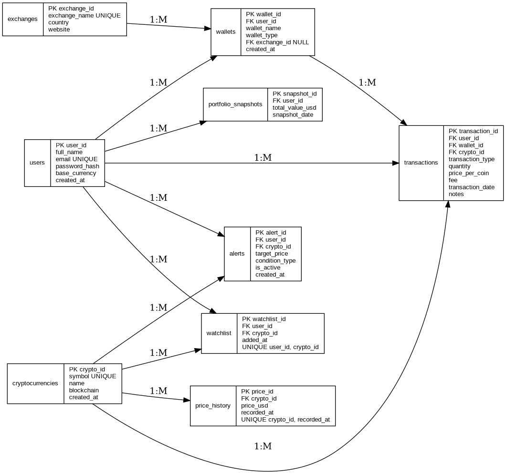
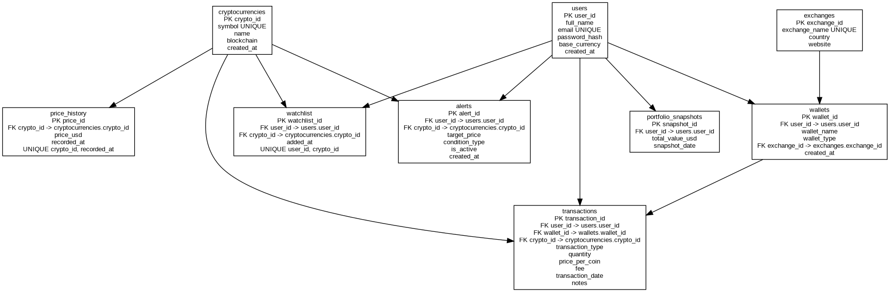

# Cryptocurrency Portfolio Tracker - SQL Database Project

## Project Overview
A complete SQL database system for tracking cryptocurrency portfolios. It manages users, wallets, exchanges, crypto assets, buy/sell/transfer transactions, price history, portfolio value, alerts, and watchlists.

## Main Features
- User management
- Crypto asset management
- Wallet and exchange management
- Buy, sell, transfer-in, transfer-out transactions
- Price history tracking
- Portfolio valuation
- Watchlist and price alerts
- Views, stored procedures, triggers, and analytical queries

## Tables
1. users
2. cryptocurrencies
3. exchanges
4. wallets
5. transactions
6. price_history
7. portfolio_snapshots
8. alerts
9. watchlist

## SQL Concepts Used
- DDL
- DML
- Primary keys
- Foreign keys
- Unique constraints
- Check constraints
- Indexes
- Joins
- Aggregate functions
- Views
- Stored procedures
- Triggers

## Folder Structure
```text
crypto_portfolio_tracker_sql/
├── sql/
│   ├── 01_schema.sql
│   ├── 02_sample_data.sql
│   ├── 03_views.sql
│   ├── 04_procedures.sql
│   ├── 05_triggers.sql
│   └── 06_business_queries.sql
├── diagrams/
│   ├── erd.png
│   └── relational_schema.png
└── docs/
    └── project_explanation.md
```

## How to Run
Run these files in MySQL Workbench in this order:

```sql
01_schema.sql
02_sample_data.sql
03_views.sql
04_procedures.sql
05_triggers.sql
06_business_queries.sql
```

## Useful Queries
```sql
SELECT * FROM v_user_total_portfolio_value;
SELECT * FROM v_portfolio_value;
SELECT * FROM v_active_alerts;
```

## Future Enhancements
- Add Python dashboard
- Add live crypto API integration
- Add login system
- Add FIFO/LIFO profit-loss calculation
- Add charts using Power BI or Python

## Entity Relationship Diagram



## Relational Schema


